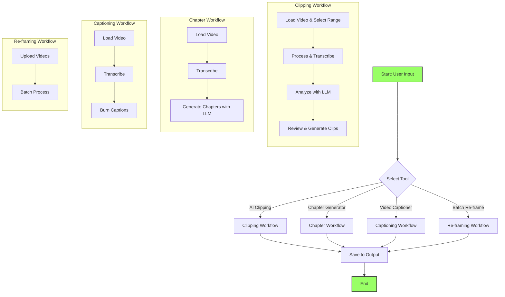

# ClipMaster: AI-Powered Video Tools

ClipMaster is a full-stack, locally-run desktop application that provides a suite of AI-powered tools to streamline video content creation. It can transform long-form videos into multiple short, vertical clips for social media, generate YouTube chapters, add animated captions, and perform batch auto-reframing.

## Overview

This application leverages local AI models for transcription and external LLM APIs for content analysis to automate complex video editing tasks. The user has full control over the process through an intuitive Gradio-based graphical user interface (GUI).

## Features

- **AI Clipping Workflow:** Intelligently extracts engaging short clips from long-form videos.
- **YouTube Chapter Generator:** Automatically creates timestamped chapters for your videos based on the transcript.
- **Video Captioner:** Burns word-by-word animated captions directly into your video for enhanced engagement.
- **Batch Auto Re-framer:** Converts multiple horizontal videos to a vertical 9:16 aspect ratio, using face detection to keep the speaker centered.
- **Flexible Video Input:** Accepts local video files (`.mp4`, `.mov`) or YouTube URLs for all features.
- **Local Transcription:** Uses Whisper for high-quality, private transcription with word-level timestamps.
- **LLM Integration:** Connects to major LLM APIs (Google Gemini, OpenAI GPT-4o, etc.) for intelligent content analysis.

## Workflow



## Project Structure

The project is organized into a modular structure to separate concerns and improve maintainability.

```
clipmaster/
│
├── app.py                  # Main application entry point
├── requirements.txt        # Project dependencies
├── api_keys.json           # Stores user-provided API keys
│
├── models/                 # Directory for ML models (e.g., face detection)
│
├── output/                 # Default directory for generated video clips
│
├── src/                    # Source code
│   ├── __init__.py
│   ├── logic.py            # Core application logic for all features
│   ├── ui.py               # Gradio UI components and layout
│   ├── events.py           # Event handlers connecting UI and logic
│   │
│   ├── analyzer.py         # Handles LLM-based analysis
│   ├── captioner.py        # Logic for burning in subtitles
│   ├── chapter_generator.py# Logic for generating YouTube chapters
│   ├── processor.py        # Video cutting and processing functions
│   ├── reframe.py          # Face-aware auto-reframing logic
│   ├── transcriber.py      # Whisper transcription handler
│   ├── utils.py            # Utility functions (API keys, file handling)
│   └── video_handler.py    # Video downloading and audio extraction
│
└── ...
```

## Technology Stack

- **Frontend/GUI:** Gradio
- **Backend & Orchestration:** Python
- **Core Modules:**
    - `src/ui.py`: Defines the Gradio interface.
    - `src/logic.py`: Contains the core business logic.
    - `src/events.py`: Manages event handling between UI and logic.
- **Video Processing:** FFmpeg, MoviePy, opencv-python
- **Video Downloading:** yt-dlp
- **Audio Transcription:** openai-whisper (local)
- **Content Analysis:** Google Gemini, OpenAI GPT-4o, DeepSeek, Claude, OpenRouter
- **Face Detection:** OpenCV DNN

## Prerequisites

Before you begin, ensure you have the following installed:
- Python 3.9+
- FFmpeg: You must have FFmpeg installed on your system and accessible from the command line.

## Installation & Setup

It is highly recommended to run this project in a virtual environment.

1.  **Clone the repository:**
    ```bash
    git clone https://github.com/your-username/clipmaster.git
    cd clipmaster
    ```

2.  **Create and activate a virtual environment:**
    
    On Windows:
    ```bash
    python -m venv venv
    .\venv\Scripts\activate
    ```

    On macOS/Linux:
    ```bash
    python3 -m venv venv
    source venv/bin/activate
    ```

3.  **Install dependencies:**
    ```bash
    pip install -r requirements.txt
    ```

4.  **Download Face Detection Models:**
    This application requires two files for its face detection engine:
    - `deploy.prototxt`
    - `res10_300x300_ssd_iter_140000_fp16.caffemodel`

    Place these files inside the `clipmaster/models/` directory.

## How to Use

1.  **Run the application:**
    ```bash
    python app.py
    ```
2.  The application will open in your web browser. Select a tool from the tabs and follow the on-screen instructions.

## Configuration

To use the AI-powered features, you need an API key from an LLM provider. You can set these keys in the "Settings" tab of the application. The keys are saved locally in an `api_keys.json` file for future sessions.

## License

This project is licensed under the MIT License. See the [LICENSE](LICENSE) file for details.
